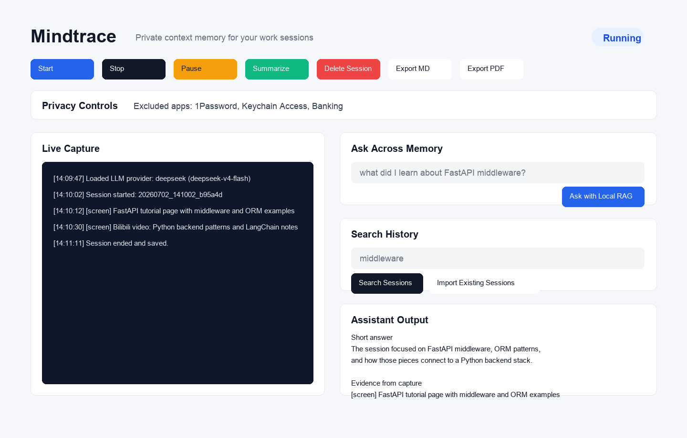
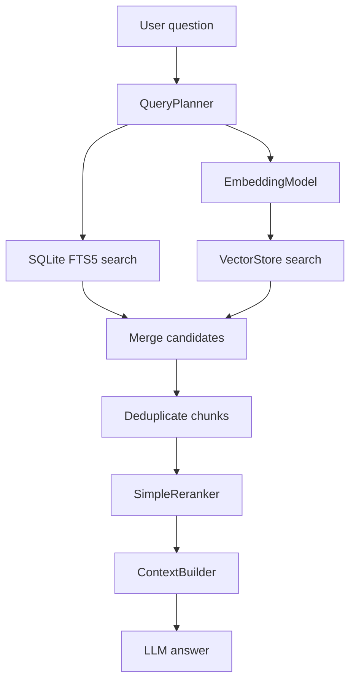
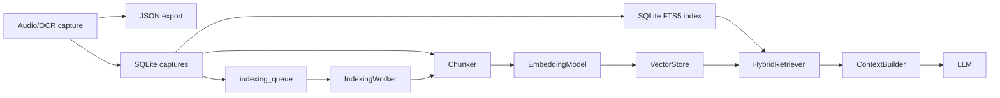

# Mindtrace

Mindtrace is a local-first desktop AI memory assistant. It captures work context, indexes it locally, and lets you summarize or ask questions across current and past sessions.

This app captures:
- audio from your input device and transcribes it to text
- text visible on your screen with OCR
- then lets you summarize or ask questions based on captured context using a configurable LLM provider

Each run is stored as a portable JSON session and indexed into SQLite for search and retrieval.

## Important

- Each user needs their own API key for AI summarize/Q&A features.
- Without an API key, capture and session saving still work, but AI features will not run.

## What this app includes

- `Start capture` button
- `Stop capture` button
- automatic session save to `sessions/`
- max duration guard (auto-stop with warning and save)
- session summary button (LLM)
- chat-style Ask Across Memory input (LLM)
- pause/resume capture controls
- current-session deletion
- sensitive app exclusion for screen capture
- local SQLite/FTS search over historical captures
- hybrid retrieval over current and historical memory
- background vector indexing queue
- screenshot frame dedupe before OCR
- Markdown/PDF summary export

## Demo



## Files

- `app.py` - main desktop app (Tkinter UI)
- `core/config.py` - config loading and environment overrides
- `core/capture_audio.py` - audio capture and Whisper transcription
- `core/capture_screen.py` - screen capture, frame dedupe, OCR preprocessing, and OCR text dedupe
- `core/session_store.py` - JSON session persistence
- `core/sqlite_store.py` - searchable SQLite session history
- `core/llm_client.py` - provider-neutral LLM client wrapper
- `core/logger.py` - structured file and console logging
- `core/exporter.py` - Markdown and lightweight PDF export
- `core/embedding.py` - provider-neutral embedding interface
- `core/vector_store.py` - FAISS-or-numpy vector search abstraction
- `core/chunker.py` - semantic-ish capture chunking with overlap
- `core/retriever.py` - hybrid FTS + embedding retrieval pipeline
- `core/reranker.py` - unified ranking from lexical, vector, recency, and source signals
- `core/context_builder.py` - prompt-ready context packing with dedupe and token budget
- `core/summarizer.py` - summary and Q&A prompts
- `core/text_dedupe.py` - text cleaning and repeated OCR filtering
- `core/image_dedupe.py` - fast frame similarity filtering before OCR
- `core/indexing_worker.py` - durable background indexing queue worker
- `core/ui_throttle.py` - throttled capture log updates for Tkinter
- `tests/` - pytest coverage for config, dedupe, session storage, and LLM initialization
- `requirements.txt` - Python dependencies
- `config.example.json` - runtime settings template
- `sessions/` - generated during runtime

## Architecture

`app.py` remains the runnable Tkinter entry point and owns UI state, buttons, and status updates. The implementation underneath is split into small core services:

- Configuration is loaded once through `core/config.py`, including `config.json` and `LLM_*` environment overrides.
- Audio and screen capture run in their own modules and call back into the UI when text or errors are produced. Whisper loads lazily in a background transcription thread so `Start capture` can return quickly.
- Sessions are exported as JSON through `core/session_store.py` and also indexed in SQLite through `core/sqlite_store.py`.
- LLM providers are hidden behind `core/llm_client.py`, while `core/summarizer.py` owns the user-facing summary and Q&A prompts.
- OCR text is deduplicated with a standard-library `difflib.SequenceMatcher` threshold of `0.90`.
- Screen capture first compares a cropped subtitle/content region using fast image difference. Near-duplicate frames are skipped before OCR.
- Runtime diagnostics go through `core/logger.py`, which writes detailed logs to `logs/app.log`.
- Markdown/PDF export is handled by `core/exporter.py` and written to `exports/`.
- Ask Across Memory uses a hybrid retrieval pipeline instead of raw keyword search.
- Vector indexes are persisted under `data/vector_index/`, validated on startup, and maintained incrementally by a background worker.

## Hybrid Retrieval Architecture

Mindtrace now separates memory capture from memory retrieval. The current retrieval architecture is:



### Data Flow



### Retrieval Modules

- `core/embedding.py` defines the `EmbeddingModel` interface. It includes OpenAI embeddings and a deterministic hashing embedding model for local/offline operation. A sentence-transformers adapter is reserved for a future local model integration.
- `core/vector_store.py` hides the vector backend. It uses FAISS when available and falls back to numpy cosine-style similarity. The vector records and metadata are persisted under `data/vector_index/`.
- `core/chunker.py` splits large captures into 300-600 token chunks with overlap so retrieval can return focused context instead of whole noisy captures.
- `core/retriever.py` runs the pipeline: query planning, FTS search, vector search, merge, dedupe, and top-k retrieval.
- `core/reranker.py` produces one score from FTS score, embedding similarity, recency, and source type.
- `core/context_builder.py` turns ranked chunks into prompt-ready context while respecting a token budget and avoiding duplicate content.

## Answer Behavior

Ask Across Memory defaults to a detailed plain-text answer. The answer should be written as natural prose, not as a rigid evidence template. By default it avoids:

- Markdown asterisks
- `Evidence from capture`
- `Likely interpretation`
- `Missing/uncertain`
- `Confidence`
- long bullet breakdowns

Users can still ask for evidence, sources, or uncertainty explicitly. In that case Mindtrace will include those details, but it still prefers readable prose over boilerplate sections.

## Privacy Controls

Mindtrace keeps capture controls explicit:

- `Pause` temporarily stops audio and screen capture without ending the session.
- `Resume` continues capture into the same session.
- `Delete Session` removes the current JSON export and SQLite records for that session.
- `Excluded apps` skips screen OCR when a listed macOS app is frontmost.

Excluded apps are comma-separated in the UI and can also be set in `config.json`:

```json
"excluded_apps": ["1Password", "Keychain Access"]
```

## Prerequisites

1. Python 3.10+
2. Tesseract OCR installed:
   - `brew install tesseract`
3. FFmpeg installed:
   - `brew install ffmpeg`
4. Optional for internal system audio capture:
   - install a virtual audio device for your OS and set it as input device
   - otherwise mic input works

## Setup

1. Open Terminal:
   - `cd /Users/tomzhang/Desktop/mindtrace`
2. Create and activate venv:
   - `python3 -m venv .venv`
   - `source .venv/bin/activate`
3. Install dependencies:
   - `pip install -r requirements.txt`
4. Create runtime config:
   - `cp config.example.json config.json`
5. Set API key for summarize/Q&A:
   - `export OPENAI_API_KEY="your_api_key_here"`
6. Run:
   - `python app.py`

DeepSeek example:

```bash
cd /Users/tomzhang/Desktop/mindtrace
source .venv/bin/activate
export LLM_PROVIDER="deepseek"
export LLM_MODEL="deepseek-v4-flash"
export DEEPSEEK_API_KEY="your_api_key_here"
python app.py
```

## LLM provider config

The app supports OpenAI, DeepSeek, Gemini, Grok, and other OpenAI-compatible chat-completion providers.

OpenAI default:

```json
"llm": {
  "provider": "openai",
  "api_key_env": "OPENAI_API_KEY",
  "base_url": "",
  "model": "gpt-4o-mini",
  "endpoint": "responses"
}
```

DeepSeek:

```json
"llm": {
  "provider": "deepseek",
  "api_key_env": "DEEPSEEK_API_KEY",
  "base_url": "https://api.deepseek.com",
  "model": "deepseek-chat",
  "endpoint": "chat"
}
```

Gemini:

```json
"llm": {
  "provider": "gemini",
  "api_key_env": "GEMINI_API_KEY",
  "base_url": "https://generativelanguage.googleapis.com/v1beta/openai/",
  "model": "gemini-3.5-flash",
  "endpoint": "chat"
}
```

Grok:

```json
"llm": {
  "provider": "grok",
  "api_key_env": "XAI_API_KEY",
  "base_url": "https://api.x.ai/v1",
  "model": "grok-4.3",
  "endpoint": "chat"
}
```

Any OpenAI-compatible provider:

```json
"llm": {
  "provider": "openai_compatible",
  "api_key_env": "OPENAI_COMPATIBLE_API_KEY",
  "base_url": "https://provider.example.com/v1",
  "model": "provider-model-name",
  "endpoint": "chat"
}
```

You can also override these settings without editing `config.json`:

```bash
export LLM_PROVIDER="deepseek"
export LLM_MODEL="deepseek-v4-flash"
export DEEPSEEK_API_KEY="your_api_key_here"
python app.py
```

For Gemini, use `LLM_PROVIDER="gemini"` and `GEMINI_API_KEY`.

For Grok, use `LLM_PROVIDER="grok"` and `XAI_API_KEY`.

## Capture quality

For better summaries and answers, the app preserves Unicode text, keeps relevant context, and uses a focused analysis prompt. OCR quality still depends heavily on screen contrast, text size, and installed Tesseract languages.

Mindtrace now avoids OCR on repeated frames:

```text
screenshot every 0.5 seconds
crop subtitle/content region
resize to 64x36
convert to grayscale
compare against recent frames
skip near-duplicates
OCR only changed frames
```

Relevant config options:

```json
{
  "screenshot_interval_seconds": 0.5,
  "ocr_scale_factor": 1.0,
  "frame_diff_threshold": 0.02,
  "subtitle_crop_top_ratio": 0.55,
  "subtitle_crop_bottom_ratio": 0.92,
  "context_limit_chars": 12000,
  "llm": {
    "timeout_seconds": 30
  }
}
```

Increase `frame_diff_threshold` if too many similar frames are OCR'd. Decrease it if subtitles are changing but being skipped. Adjust the subtitle crop ratios if the important text is not near the lower-middle part of the screen.

Check installed OCR languages:

```bash
tesseract --list-langs
```

If you capture Chinese screens, install Chinese OCR data and update `config.json`:

```bash
brew install tesseract-lang
```

```json
"ocr_language": "eng+chi_sim"
```

For mixed English/Chinese audio, leave `audio_language` as `null` so Whisper can auto-detect. Use `"zh"` or `"en"` only when you want to force one language.

## Logging

The app writes structured runtime logs to `logs/app.log` and prints important events to the console. Logs include app start, capture start/stop, session saves, LLM request start/end/error, OCR errors, audio transcription errors, retrieval timings, SQLite save timings, enqueue timings, OCR cycle timings, and batch indexing timings.

Detailed stack traces stay in the log file. The Tkinter UI shows shorter user-friendly messages so capture or LLM failures do not crash the window.

`logs/` is ignored by git.

## Testing

Run the basic test suite with:

```bash
python -m py_compile app.py core/*.py
python -m pytest
```

The tests cover config loading, `LLM_*` environment overrides, OCR text deduplication, image frame deduplication, JSON session save/load, SQLite/FTS storage, hybrid retrieval, vector persistence, background indexing, prompt behavior, and LLM client initialization. Tests do not call real LLM APIs.

## Searchable History

Each run is saved in two places:

- `sessions/<session_id>.json` keeps a portable JSON export for that session.
- `data/mindtrace.db` stores searchable session history in SQLite.

The Tkinter UI includes a `Search memory` box. Type a keyword or phrase, click `Search`, and matching historical captures will appear in the chat output with source, snippet, and a relevance rank when FTS provides one.

Search uses SQLite FTS5 when it is available. Matched terms are marked in snippets with square brackets. If the local SQLite build does not support FTS5, the app falls back to simple `LIKE` search automatically.

Click `Import old sessions` to backfill older JSON exports from `sessions/` into `data/mindtrace.db`. Imported sessions are skipped on later imports when their `session_id` already exists, so the button is safe to click more than once.

An external vector database is intentionally not included yet; vector search is handled behind `core/vector_store.py`.

## Local RAG

Questions use the current session plus relevant hybrid retrieval results from previous captures. This makes Q&A useful even after a session has ended, as long as the old JSON sessions have been imported or the captures were saved after SQLite indexing was added.

The default embedding backend is local deterministic hashing, which keeps the app runnable without an embedding API key. Set `EMBEDDING_PROVIDER=openai` and `EMBEDDING_MODEL=text-embedding-3-small` to use OpenAI embeddings.

Future retrieval improvements:

- add a real local sentence-transformers embedding backend
- add a learned reranker model
- add per-user memory retention policies
- add evaluation datasets for retrieval quality

## Persistent Vector Index

Mindtrace persists its vector index in:

```text
data/vector_index/embeddings.npy
data/vector_index/manifest.json
```

SQLite stores vector metadata in the `vector_chunks` table:

- `vector_id`
- `session_id`
- `capture_id`
- `chunk_id`
- `timestamp`
- `source`
- `text`
- `embedding_model_name`
- `embedding_dimension`
- `created_at`

`embeddings.npy` stores the compact float32 vector matrix. `manifest.json` tracks index health:

- `embedding_model_name`
- `embedding_dimension`
- `vector_count`
- `created_at`
- `updated_at`

On app start, the retriever does a fast vector index health check. If the index is healthy, it loads in the background. If the manifest is missing/corrupt, `embeddings.npy` is missing, vector counts do not match, or the embedding model/dimension changed, Mindtrace marks the vector index as stale and rebuilds it in the background. While the vector index is stale or rebuilding, Ask Across Memory falls back to SQLite FTS search so the UI can remain useful.

New captures are indexed incrementally by the background worker: the app chunks and embeds only new captures, inserts metadata into `vector_chunks`, appends vectors to `embeddings.npy`, and updates `manifest.json`. The worker processes captures in batches and saves the vector matrix once per batch instead of once per capture.

The retriever exposes `rebuild_vector_index()` for clean full rebuilds from SQLite when needed. Session deletion removes related SQLite rows and vector metadata immediately, marks the vector index dirty, and compacts/rebuilds in the background.

## Background Indexing Queue

Capture saving is decoupled from embedding and vector indexing. When a new capture is saved:

1. The capture is written to SQLite and FTS immediately.
2. A job is inserted into `indexing_queue`.
3. The UI remains responsive.
4. `core/indexing_worker.py` processes the job in a background thread.

The queue table stores:

- `capture_id`
- `session_id`
- `status`: `pending`, `processing`, `done`, or `failed`
- `attempts`
- `error`
- `created_at`
- `updated_at`

The worker retries failed jobs up to 3 attempts. Permanent failures are marked `failed` and logged without crashing the app. Full vector rebuilds mark old pending/processing/failed jobs as `done` after the rebuilt index is consistent.

## Export

After clicking `Summarize`, use:

- `Export Markdown` to write `exports/<session_id>_session_summary.md`
- `Export PDF` to write `exports/<session_id>_session_summary.pdf`

The PDF export is intentionally lightweight and dependency-free.

## GitHub publishing safety

- Never commit real API keys.
- Keep your real runtime config in `config.json` (ignored by git).
- Only commit `config.example.json`.
- `.gitignore` is set to exclude `.venv/`, `sessions/`, `.DS_Store`, and `config.json`.
- If a key was ever exposed, revoke it in OpenAI and create a new one.

## Permissions you must grant

- Screen capture permission for Python/Terminal (for OCR)
- Microphone permission for Python/Terminal (for audio)

Without these permissions, capture will fail.

## Notes on long runtime

- Controlled by `max_duration_seconds` in `config.json`
- default is `7200` seconds (2 hours)
- when limit is reached, app:
  1) shows warning
  2) stops capture
  3) saves the session

## Session format

Each session is saved as `sessions/<session_id>.json` with:
- `session_id`
- `started_at`
- `ended_at`
- `duration_seconds`
- `app_version`
- `llm_provider`
- `llm_model`
- `capture_counts` for `audio` and `screen`
- `entries`, each with timestamp, source (`audio` or `screen`), and captured text

## Current limitations

- "System audio" capture on macOS often needs virtual audio device setup (BlackHole/Loopback). Without that, Mindtrace captures microphone/input-device audio, not necessarily video audio.
- OCR quality depends on text size and contrast.
- Screenshot OCR is a fallback for video and web content. Captions/transcripts or system audio transcription would be more reliable for "what did the speaker say?" questions.
- LLM summary/Q&A needs internet and a valid provider API key.
- This is not a signed production macOS app bundle yet.

## Next upgrades (recommended)

- Use native macOS app packaging (py2app or Swift frontend)
- Add system audio capture support
- Add browser transcript/caption capture for YouTube, Coursera, and Bilibili
- Add active-window OCR regions instead of full-screen screenshot regions
- Add a signed installer and permissions onboarding
- Add retrieval quality evaluation data
